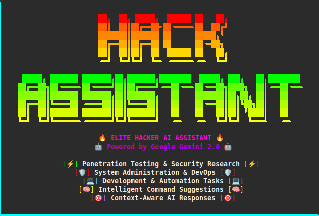

# HackAssistant - Hacker AI Assistant

A powerful Python CLI tool that leverages Google Gemini AI to provide intelligent assistance for hacking, development, and system administration tasks on Linux systems.



## Features

- 🤖 **AI-Powered Assistance**: Uses Google Gemini API for intelligent responses
- 🖥️ **Command Suggestions**: Suggests relevant Linux terminal commands
- ✅ **Interactive Execution**: Accept/deny commands with y/n prompts
- 🔄 **Continuous Workflow**: Automatically continues working after command execution
- 📝 **Context Awareness**: Maintains conversation history and working directory context
- 🎯 **Hacker-Focused**: Tailored for security researchers, developers, and system administrators

## Installation

1. **Clone or download the project**:
   ```bash
    git clone https://github.com/naggar023/hackassistant.git
   ```

2. **Install dependencies**:
   ```bash
   pip install -r requirements.txt
   ```

3. **Set up your Google Gemini API key**:
   ```bash
   export GEMINI_API_KEY='your_google_gemini_api_key_here'
   ```
   
   To make it permanent, add to your `~/.bashrc`:
   ```bash
   echo 'export GEMINI_API_KEY="your_google_gemini_api_key_here"' >> ~/.bashrc
   source ~/.bashrc
   ```

## Usage

### Basic Usage

Run the HackAssistant:
```bash
python hackassistant.py
```

### Commands

- **Normal prompts**: Just type your question or request
- **`p` + Enter**: Enter prompt mode (for new prompts)
- **`c` + Enter**: Close conversation and exit
- **`y`**: Accept and execute suggested command
- **`n`**: Decline suggested command

### Example Session

```
🚀 HackAssistant initialized!
📁 Working directory: /home/naggar/hackassistant
💻 System: Linux 6.5.0 (x86_64)

🔥 hackassistant> scan for open ports on localhost

🤖 AI Response:
I'll help you scan for open ports on localhost. This is useful for security assessment and system monitoring.

💡 Suggested command:
📋 nmap -sT localhost

❓ Execute this command? (y/n): y

🔧 Executing: nmap -sT localhost
📤 Command Output:
STDOUT:
Starting Nmap 7.80 ( https://nmap.org ) at 2025-07-01 10:30 UTC
Nmap scan report for localhost (127.0.0.1)
Host is up (0.000010s latency).
...

🔄 Continue working... (enter 'p' for new prompt, 'c' to close)
```

## API Key Setup

### Getting a Google Gemini API Key

1. Visit [Google AI Studio](https://aistudio.google.com/app/apikey)
2. Create a new API key
3. Copy the key and set it as an environment variable

### Environment Variable Setup

**Temporary (current session only)**:
```bash
export GOOGLE_API_KEY='your_api_key_here'
```

**Permanent (recommended)**:
```bash
echo 'export GOOGLE_API_KEY="your_api_key_here"' >> ~/.bashrc
source ~/.bashrc
```

## Features in Detail

### Smart Command Suggestions
- Analyzes your requests and suggests appropriate Linux commands
- Considers your current working directory and system context
- Provides explanations for suggested commands

### Interactive Execution
- Review commands before execution
- See real-time output from executed commands
- Continue working with the AI after command execution

### Context Awareness
- Remembers conversation history
- Tracks working directory and system information
- Maintains context across command executions

### Security Focus
- Designed for penetration testers and security researchers
- Suggests security-relevant commands and tools
- Helps with system administration tasks

## Project Structure

```
hackassistant/
├── hackassistant.py      # Main application
├── requirements.txt      # Python dependencies
├── README.md            # This file
└── .github/
    └── copilot-instructions.md  # Copilot instructions
```

## Development

### Running in Development Mode

```bash
python hackassistant.py
```

### Installing in Development Mode

For development, you might want to make the script executable:

```bash
chmod +x hackassistant.py
```

Then you can run it directly:
```bash
./hackassistant.py
```

## Troubleshooting

### Common Issues

1. **API Key Not Set**:
   ```
   ❌ Error: GOOGLE_API_KEY environment variable not set!
   ```
   Solution: Set your Google Gemini API key as shown in the setup section.

2. **Permission Denied on Commands**:
   Some suggested commands might require sudo privileges. The AI will suggest appropriate commands, but always review before executing.

## Contributing

This is a personal hacking tool, but feel free to fork and modify it for your needs.

## License

This project is for educational and legitimate security research purposes only.

## Disclaimer

This tool is designed for legitimate security research, system administration, and development purposes. Users are responsible for ensuring their use complies with applicable laws and regulations.
